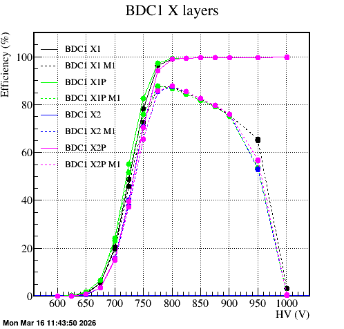

# dceffplot

analyze run and make plot of efficiency curve of a drift chamber.

## Requirements
- ROOT v6
- ANAROOT

## How to install
<code>$ cd dceffplot</code>

If TARTSYS is not defined, run setup.sh of ANAROOT

<code>$ mkdir build
$ mkdir install
$ cd build
$ cmake -DCMAKE_INSTALL_PREFIX=../install ../sources
$ make install</code>

## How to use
1. modify runlist.txt
1. modify run_xxx.cc for your directories
1. $ root[] .L dceffplot/install/lib/dceffplot.so
1. $ root[] run_xxx.cc

(in case of NEOLITH)
- modify map.txt

Then, efficiency plots will be created.

example:

